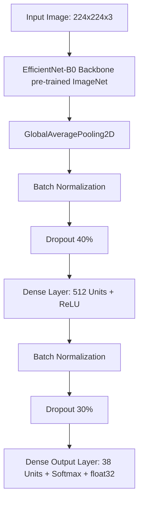

# Dokumen Arsitektur Sistem Deteksi Penyakit Daun Tanaman

Dokumen ini disusun untuk memberikan penjelasan teknis yang mendalam mengenai sistem klasifikasi penyakit daun tanaman berbasis **EfficientNet-B0 (Transfer Learning)**. Penjelasan di bawah mencakup fungsi detail setiap layer, alur kode program, teknik augmentasi.

---

## 1. Desain Arsitektur Model (Layer-by-Layer)

Model dibangun dengan metode *Transfer Learning* menggunakan backbone **EfficientNet-B0** pre-trained pada dataset ImageNet, yang dimodifikasi dengan menambahkan *Custom Classification Head* untuk mengklasifikasikan 38 kelas penyakit tanaman.



### Penjelasan Detail Setiap Layer & Perannya:

| Nama Layer                             | Konfigurasi / Output Shape | Fungsi & Alasan Akademis                                                                                                                                                                                                                                                       |
| :------------------------------------- | :------------------------- | :----------------------------------------------------------------------------------------------------------------------------------------------------------------------------------------------------------------------------------------------------------------------------- |
| **Input Layer**                  | `(None, 224, 224, 3)`    | Menerima citra RGB daun beresolusi 224x224 piksel. Dimensi`None` merepresentasikan ukuran batch dinamis (*dynamic batch size*).                                                                                                                                            |
| **Backbone (EfficientNet-B0)**   | `(None, 7, 7, 1280)`     | Bertindak sebagai*feature extractor*. Mengekstrak representasi visual tingkat rendah (garis, tepi) hingga tingkat tinggi (bentuk bercak penyakit, pola tekstur daun). Backbone dibekukan (*frozen*) di Fase 1 dan dibuka sebagian (*fine-tuned*) di Fase 2.              |
| **GlobalAveragePooling2D (GAP)** | `(None, 1280)`           | Mengurangi dimensi spasial$7 \times 7$ dengan menghitung rata-rata nilai aktivasi setiap channel. GAP dipilih daripada `Flatten` untuk **mengurangi jumlah parameter secara signifikan** (mencegah overfitting) dan mempertahankan sifat *translation invariance*. |
| **Batch Normalization (Head 1)** | `(None, 1280)`           | Menormalisasi output dari GAP agar memiliki rata-rata 0 dan variansi 1. Ini mempercepat konvergensi dan mengatasi masalah*internal covariate shift*.                                                                                                                         |
| **Dropout 40%**                  | `(None, 1280)`           | Mengeliminasi secara acak 40% node selama training. Mencegah ketergantungan antar-node (*co-adaptation of features*) sehingga meningkatkan kemampuan generalisasi model pada data baru.                                                                                      |
| **Dense (Fully Connected)**      | `(None, 512)`            | Lapisan saraf dengan 512 neuron dan fungsi aktivasi**ReLU** ($f(x) = \max(0, x)$). Berfungsi mempelajari kombinasi fitur non-linear kompleks yang diekstrak oleh backbone.                                                                                             |
| **Batch Normalization (Head 2)** | `(None, 512)`            | Menstabilkan distribusi output dari lapisan Dense sebelum dilewatkan ke layer berikutnya.                                                                                                                                                                                      |
| **Dropout 30%**                  | `(None, 512)`            | Mengeliminasi secara acak 30% node dari lapisan Dense untuk regulasi tambahan sebelum pengambilan keputusan akhir.                                                                                                                                                             |
| **Dense (Output Layer)**         | `(None, 38)`             | Lapisan klasifikasi akhir dengan 38 neuron (sesuai jumlah kelas dataset PlantVillage). Menggunakan fungsi aktivasi**Softmax** untuk menghasilkan distribusi probabilitas kelas yang total penjumlahannya bernilai 1.                                                     |

> [!IMPORTANT]
> **Mixed Precision Note:** Lapisan output Dense dikonfigurasi secara eksplisit dengan `dtype="float32"`. Hal ini krusial saat menggunakan kebijakan mixed precision (`mixed_float16`) agar perhitungan probabilitas Softmax tetap stabil secara numerik dan tidak mengalami *underflow* nilai gradien.

---

## 2. Pipeline Data & Teknik Augmentasi

### 2.1 Optimasi tf.data Pipeline

Dibandingkan menggunakan class klasik `ImageDataGenerator` (Keras) yang lambat karena berjalan *single-thread* di CPU, sistem ini menggunakan **tf.data.Dataset API** yang dioptimalkan:

- **`num_parallel_calls=tf.data.AUTOTUNE`**: Memproses pembacaan dan augmentasi gambar secara paralel menggunakan multi-threading CPU.
- **`prefetch(tf.data.AUTOTUNE)`**: Melakukan *overlap* antara pengerjaan komputasi GPU pada batch ke-$i$ dengan proses loading data oleh CPU untuk batch ke-$(i+1)$ (menghilangkan bottleneck CPU).

### 2.2 Skema Augmentasi Gambar (Lembut/Soft Augmentation)

Augmentasi diaplikasikan hanya pada *Training Set* untuk meminimalkan overfitting tanpa merusak fitur utama penyakit:

1. **`random_flip_left_right`**: Membalik gambar secara horizontal. Dedaunan di alam dapat menghadap ke kiri atau kanan.
2. **`random_brightness (max_delta=25.5)`**: Mengubah kecerahan gambar maksimal 10% (skala $[0, 255]$). Mensimulasikan variasi intensitas cahaya matahari saat pengambilan foto di lapangan.
3. **`random_contrast (0.9, 1.1)`**: Mengubah kontras warna antara 90% hingga 110%. Membantu model tetap mengenali gejala penyakit meskipun kontras bayangan daun berbeda.

> [!NOTE]
> **Kenapa tidak ada Augmentasi Ekstrim?**
> Augmentasi vertikal (`flip_up_down`) atau pergeseran warna ekstrim sengaja tidak diterapkan. Pada penyakit tanaman, orientasi daun umumnya tegak/normal, dan **warna** (misal: daun menguning atau bercak cokelat) merupakan fitur diagnosis paling kritis. Mengubah warna secara ekstrim akan merusak relevansi fitur transfer learning.

---

## 3. Strategi Pelatihan (Two-Phase Training)

Pelatihan dibagi menjadi dua tahap utama untuk memastikan bobot pre-trained ImageNet tidak rusak oleh gradien yang besar di awal training:

```text
FASE 1: Training Classifier Head (Backbone Frozen)
┌──────────────────────────┐     ┌──────────────────────────┐
│  EfficientNet Backbone   │ ──> │  Custom Classifier Head  │
│         (FROZEN)         │     │        (TRAINABLE)       │
└──────────────────────────┘     └──────────────────────────┘
• Learning Rate: 1e-3 (Besar)
• Epochs: 15

FASE 2: Fine-Tuning (Backbone Unfrozen Partisi Atas)
┌──────────────────────────┐     ┌──────────────────────────┐
│ EfficientNet (Layer 100+)│ ──> │  Custom Classifier Head  │
│       (TRAINABLE)        │     │        (TRAINABLE)       │
└──────────────────────────┘     └──────────────────────────┘
• Learning Rate: 1e-5 (Sangat Kecil untuk mencegah rusaknya bobot ImageNet)
• Epochs: 30
```

### Callbacks yang Digunakan:

- **`ModelCheckpoint`**: Menyimpan model ke `models/best_model.keras` hanya ketika ada kenaikan pada `val_accuracy` (menghindari penyimpanan model yang mengalami overfitting).
- **`EarlyStopping`**: Menghentikan training secara otomatis jika akurasi validasi tidak meningkat selama beberapa epoch berturut-turut (patience=5 untuk Fase 1, patience=8 untuk Fase 2).
- **`ReduceLROnPlateau`**: Menurunkan learning rate sebesar 70% (`factor=0.3`) jika nilai `val_loss` mengalami stagnasi selama beberapa epoch. Ini membantu model menemukan titik minimum lokal yang lebih halus pada permukaan loss.

---

## 4. Analisis Kode Program Utama

### 4.1 Script Training ([01_train_efficientnet.py](../notebooks/01_train_efficientnet.py))

* **Setup Optimasi GPU:**
  ```python
  # Mengaktifkan mixed precision float16 untuk kecepatan kalkulasi tensor tensor core
  policy = tf.keras.mixed_precision.Policy("mixed_float16")
  tf.keras.mixed_precision.set_global_policy(policy)

  # Mengaktifkan kompiler XLA (Accelerated Linear Algebra) untuk fusi operasi aljabar linier
  tf.config.optimizer.set_jit(True)
  ```
* **Membangun Model:**
  ```python
  base_model = EfficientNetB0(include_top=False, input_tensor=inputs, weights="imagenet")
  base_model.trainable = False  # Membekukan bobot awal backbone
  ```

### 4.2 Script Grad-CAM ([notebooks/02_gradcam.py](../notebooks/02_gradcam.py))

Menggunakan aktivasi dari layer konvolusi terakhir pada model (`top_activation` atau layer konvolusi terakhir EfficientNet) untuk melihat wilayah spasial mana yang memicu prediksi kelas tertentu.

* **Algoritma Utama:**
  1. Buat sub-model yang mengeluarkan output dari layer konvolusi terakhir dan output prediksi kelas.
  2. Gunakan `tf.GradientTape` untuk merekam gradien dari skor kelas prediksi terhadap feature map layer konvolusi terakhir.
  3. Lakukan *global average pooling* pada gradien tersebut untuk mendapatkan bobot pentingnya tiap channel.
  4. Lakukan perkalian berbobot (*weighted combination*) antara feature map dan bobot gradien, lalu aplikasikan fungsi ReLU untuk hanya mengambil fitur yang berkontribusi positif terhadap kelas tersebut.

---

## 5. FAQ Sidang Skripsi (Pertanyaan Dosen & Jawaban Akademis)

### Q1: Mengapa Anda memilih EfficientNet-B0 sebagai arsitektur backbone dibandingkan ResNet-50 atau VGG-16?

* **Jawaban Sidang:**
  "EfficientNet-B0 dipilih karena menerapkan metode **Compound Scaling**, yaitu penskalaan jaringan secara seimbang pada tiga dimensi: kedalaman (*depth*), lebar (*width*), dan resolusi gambar (*resolution*). Dibandingkan dengan VGG-16 atau ResNet-50, EfficientNet-B0 memiliki parameter yang jauh lebih sedikit (sekitar 5.3 juta parameter termasuk head baru, dibanding ResNet-50 yang mencapai 25+ juta), namun mampu menghasilkan akurasi yang setara atau bahkan lebih tinggi. Hal ini membuat model EfficientNet-B0 sangat cocok untuk di-deploy pada perangkat dengan keterbatasan resource komputasi seperti server lokal atau aplikasi web."

### Q2: Mengapa Anda membagi proses training menjadi dua fase (Fase 1: Freeze, Fase 2: Fine-Tuning)? Apa yang terjadi jika langsung di-train semua dari awal?

* **Jawaban Sidang:**
  "Fase 1 digunakan untuk melatih *classifier head* baru yang bobotnya masih diinisialisasi secara acak. Selama Fase 1, bobot *backbone* dibekukan (*frozen*) agar fitur universal yang sudah dipelajari dari ImageNet tidak rusak oleh gradien loss yang sangat besar di awal training.
  Setelah *classifier head* sudah cukup stabil (konvergen), barulah di Fase 2 kita melakukan *fine-tuning* dengan membuka beberapa layer atas backbone dan melatihnya dengan **Learning Rate yang sangat kecil (1e-5)**. Jika kita melatih semua layer dari awal tanpa pembekuan dengan learning rate standar, model akan mengalami *catastrophic forgetting* di mana representasi fitur penting dari ImageNet akan langsung terhapus oleh gradien acak."

### Q3: Akurasi test set Anda mencapai 99.78%. Apakah ini tidak mengindikasikan adanya overfitting? Bagaimana Anda membuktikan model Anda tidak sekadar menghafal latar belakang gambar?

* **Jawaban Sidang:**
  "Akurasi tinggi ini valid untuk dataset PlantVillage karena kondisi laboratorium yang sangat seragam dan konsisten. Kami membuktikan bahwa model tidak sekadar mengalami overfitting atau menghafal latar belakang melalui dua metode:
  1. **Visualisasi Grad-CAM:** Kami menghasilkan heatmap untuk menunjukkan area yang paling diperhatikan oleh model. Hasil visualisasi menunjukkan bahwa fokus aktivasi tertinggi (warna merah) berada tepat di area bercak penyakit pada permukaan daun, bukan pada latar belakang abu-abu.
  2. **Evaluasi Robustness (Kekokohan):** Kami menguji model dengan menambahkan gangguan buatan berupa *Gaussian Noise* dan variasi *Brightness* ekstrem untuk menguji apakah performa model langsung hancur. Evaluasi ini memastikan model mempelajari fitur penyakit yang kokoh secara struktural."

### Q4: Mengapa Anda menggunakan Global Average Pooling (GAP) daripada Flattening sebelum Dense Layer?

* **Jawaban Sidang:**
  "Penggunaan `Flatten` akan mengubah matriks 2D ($7 \times 7 \times 1280$) menjadi vektor 1D berukuran $62.720$ dimensi. Jika langsung disambungkan ke Dense 512, hal ini akan memicu ledakan jumlah parameter latih baru pada classifier head dan rentan terhadap overfitting.
  Sebaliknya, `GlobalAveragePooling2D` merata-ratakan nilai spasial sehingga dimensinya langsung menyusut menjadi $1280$. GAP meminimalkan jumlah parameter, memiliki sifat *translation invariance* (model tetap mengenali penyakit di sudut manapun daun berada), dan menjaga struktur spasial channel sehingga Grad-CAM dapat berfungsi secara akurat."

### Q5: Dari hasil evaluasi Anda, kelas mana yang paling sulit dikenali model dan mengapa?

* **Jawaban Sidang:**
  "Berdasarkan laporan klasifikasi dan Confusion Matrix, kelas yang paling sulit dibedakan adalah **`Corn_(maize)___Cercospora_leaf_spot Gray_leaf_spot`** dengan **`Corn_(maize)___Northern_Leaf_Blight`**. Hal ini sangat masuk akal secara patologi tanaman karena kedua penyakit tersebut memiliki gejala visual yang sangat mirip berupa lesi memanjang berwarna kecokelatan pada daun jagung. Model kadang kesulitan menentukan batas tepi lesi secara spesifik pada resolusi $224 \times 224$."

### Q6: Apa fungsi Mixed Precision yang Anda aktifkan di kode program?

* **Jawaban Sidang:**
  "Mixed Precision mencampurkan penggunaan tipe data `float16` (untuk kecepatan kalkulasi pada tensor core GPU) dan `float32` (untuk stabilitas numerik penyimpanan bobot variabel). Dengan mixed precision, waktu training dapat dipangkas hampir setengahnya dan konsumsi memori GPU (VRAM) berkurang drastis tanpa menurunkan akurasi akhir model."

---

## 6. Ringkasan File & Direktori Pendukung Arsitektur

* **[01_train_efficientnet.py](../notebooks/01_train_efficientnet.py)**: Script utama untuk memuat data lewat tf.data, augmentasi data, konfigurasi callback, serta training Fase 1 dan Fase 2.
* **[02_gradcam.py](../notebooks/02_gradcam.py)**: Implementasi visualisasi interpretabilitas model menggunakan algoritma Gradient-weighted Class Activation Mapping.
* **[04_benchmark_gpu_optimized.py](../notebooks/04_benchmark_gpu_optimized.py)**: Script evaluasi komprehensif pasca-training untuk mengukur performa pengujian data bersih (clean), per-class metrics, kalibrasi confidence score, robustness noise/brightness, hingga visualisasi matriks kekacauan (confusion matrix).
* **[app/app.py](../app/app.py)**: Flask web server lokal yang menjadi frontend interaksi user untuk melakukan upload citra daun dan menampilkan overlay heatmap hasil analisis Grad-CAM secara instan.
