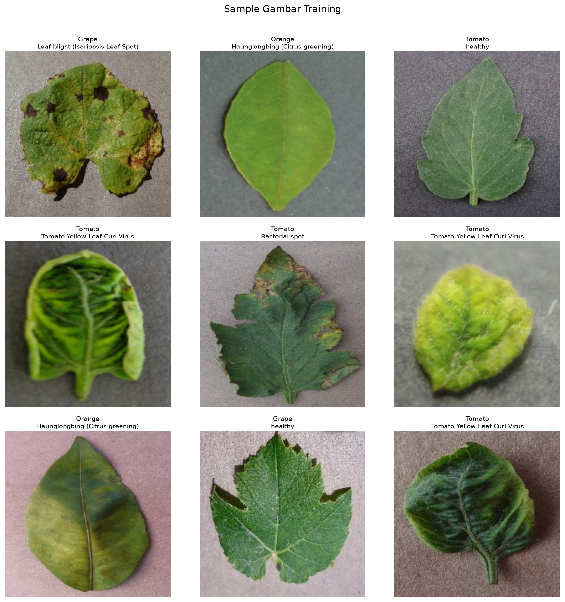
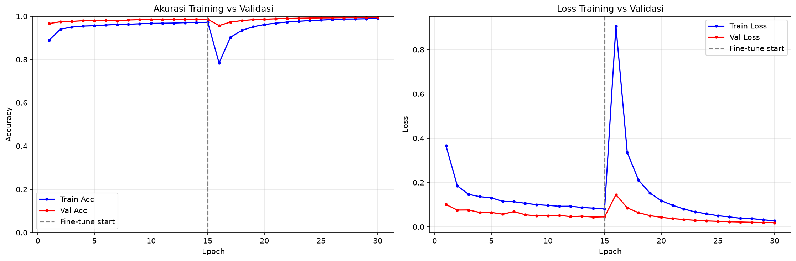
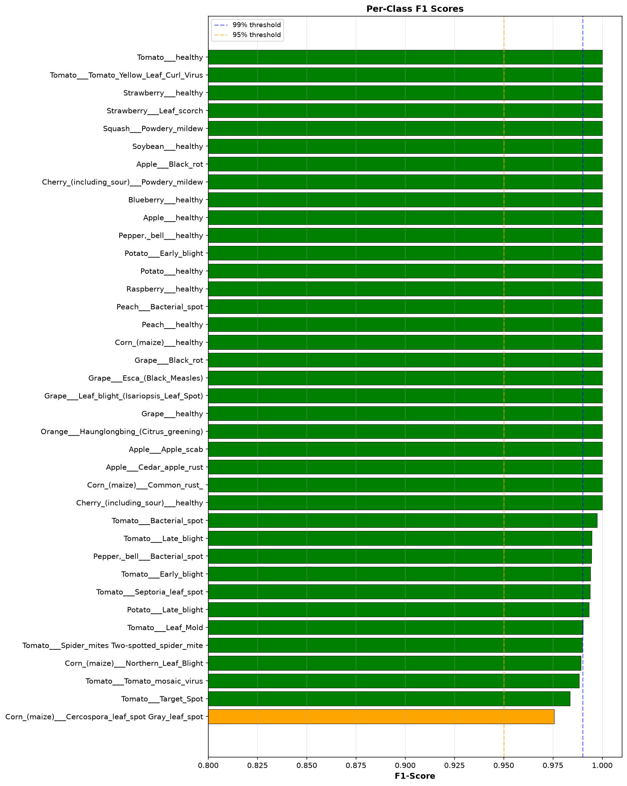
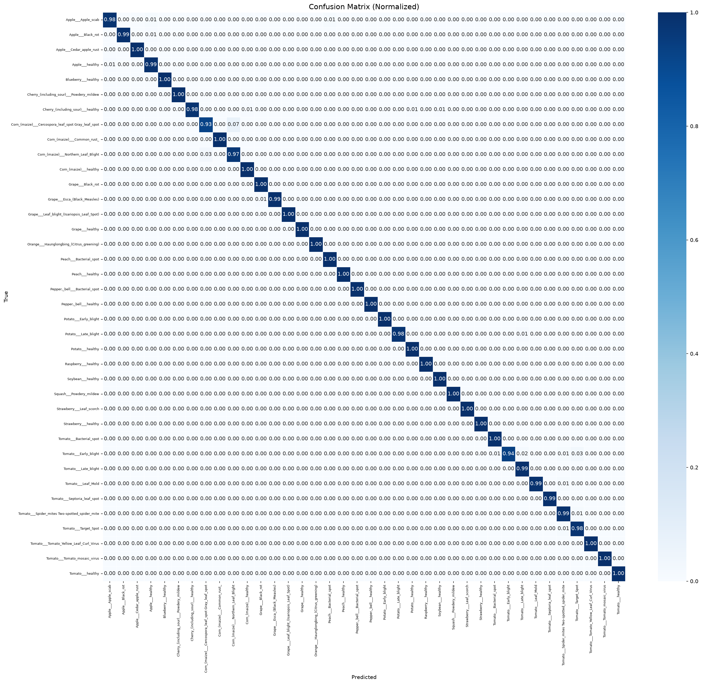
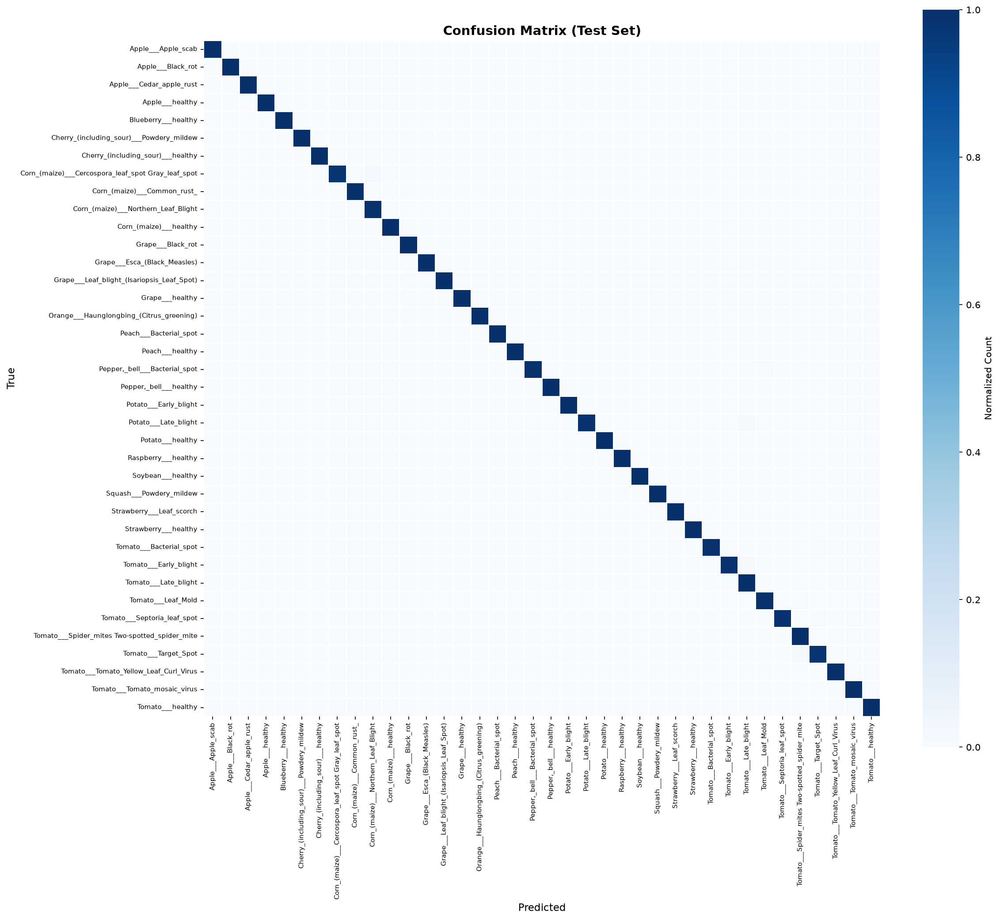
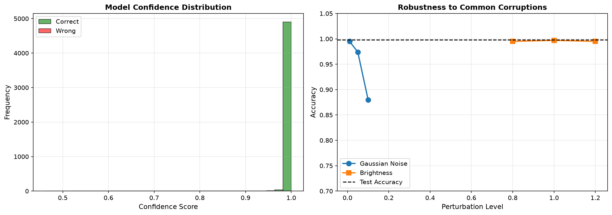

# Panduan Cara Menjelaskan Gambar Output Evaluasi Model
## *(Panduan Sidang Skripsi & Presentasi)*

Dokumen ini dibuat khusus untuk memandu Anda mempresentasikan **6 gambar visualisasi utama** yang ada di folder `outputs/` kepada dosen penguji. Penjelasan di bawah menggunakan bahasa yang lugas, terstruktur, dan meyakinkan secara ilmiah, lengkap dengan tampilan gambar dan narasi cara membaca gambarnya langsung.

---

## Gambar 1: `sample_images.png` (Sampel Gambar Training)

### Narasi Deskripsi Gambar (Bagaimana Cara Membacanya):
> *"Secara visual, gambar ini menyajikan susunan grid 3x3 yang berisi sembilan foto daun asli dengan latar belakang abu-abu seragam. Setiap foto daun memiliki label hijau di bagian atasnya yang menunjukkan nama tanaman beserta jenis penyakitnya (contoh: Apple Black Rot, Corn Common Rust). Gambar ini memperlihatkan bahwa data latih yang dimasukkan ke dalam model memiliki kualitas piksel yang tajam, dengan objek daun berada tepat di tengah frame, memudahkan filter konvolusi model mengenali bentuk fisik dan warna penyakit tanpa distraksi background."*

### A. Apa yang Diperlihatkan Gambar Ini?
Gambar ini menampilkan grid berukuran $3 \times 3$ yang berisi 9 sampel acak dari dataset pelatihan (*training set*) lengkap dengan label jenis tanaman dan kondisi penyakitnya yang dicetak di atas masing-masing gambar.

### B. Cara Menjelaskannya Saat Presentasi:
> *"Bapak/Ibu Penguji, gambar ini merupakan representasi visual dari data yang dipelajari oleh model selama proses training. Dataset PlantVillage yang kami gunakan mencakup berbagai varietas tanaman (seperti tomat, kentang, apel, jagung) dengan kondisi daun yang sehat maupun daun yang memiliki bercak patologi spesifik. Hal ini membuktikan bahwa variabilitas data latih kami sangat kaya dan terlabeli dengan rapi."*

### C. Pertanyaan Penguji & Jawaban Anda:
* **Tanya:** *"Mengapa ukuran dan background gambarnya seragam sekali?"*
* **Jawab:** *"Betul Pak/Bu, dataset benchmark PlantVillage ini diambil dalam kondisi lingkungan laboratorium yang terkontrol dengan latar belakang abu-abu seragam agar model dapat berfokus mempelajari pola lesi penyakit pada daun tanpa terdistraksi oleh variasi background tanah atau rumput."*

---

## Gambar 2: `training_curves.png` (Kurva Akurasi dan Loss)

### Narasi Deskripsi Gambar (Bagaimana Cara Membacanya):
> *"Gambar ini terbagi menjadi dua panel grafik. Panel kiri menunjukkan perkembangan nilai Akurasi, dan panel kanan menunjukkan nilai Loss (tingkat kesalahan). Sumbu X mewakili jumlah Epoch (iterasi latihan), dan sumbu Y mewakili nilai akurasi/loss. Garis biru menunjukkan performa pada data training, sedangkan garis merah menunjukkan performa pada data validasi. Terdapat garis putus-putus abu-abu vertikal di tengah grafik yang menandakan transisi dari Fase 1 (melatih classifier head) ke Fase 2 (Fine-tuning). Secara visual terlihat kedua kurva akurasi langsung menanjak tajam dan menetap di atas 99%, sementara kurva loss meluncur turun hingga mendekati nol secara stabil pasca-garis abu-abu."*

### A. Apa yang Diperlihatkan Gambar Ini?
Gambar ini memiliki dua grafik: sebelah kiri adalah **Kurva Akurasi** (latih vs validasi) dan sebelah kanan adalah **Kurva Loss** (latih vs validasi) sepanjang epoch pelatihan, dipisahkan oleh garis putus-putus abu-abu yang menandakan dimulainya fase *Fine-Tuning*.

### B. Cara Menjelaskannya Saat Presentasi:
> *"Grafik ini menunjukkan histori pembelajaran model. Garis biru adalah performa data latih, dan garis merah adalah data validasi. Garis vertikal abu-abu menunjukkan batas antara Fase 1 (melatih kepala klasifikasi) dan Fase 2 (Fine-tuning). Bisa kita lihat, ketika memasuki Fase 2, nilai akurasi (kiri) langsung melonjak stabil mendekati 99% dan nilai loss (kanan) turun drastis mendekati nol secara beriringan. Hal ini membuktikan transisi pelatihan dua fase kami berjalan sukses tanpa gejala overfitting."*

### C. Pertanyaan Penguji & Jawaban Anda:
* **Tanya:** *"Mengapa garis merah (validasi) kadang berada di atas garis biru (latih) di awal?"*
* **Jawab:** *"Hal itu terjadi karena kami menerapkan **Data Augmentation** (seperti random brightness dan flip) pada data training untuk mempersulit proses belajar model agar lebih tangguh, sedangkan data validasi tidak diberi gangguan augmentasi sehingga lebih mudah diprediksi di awal epoch."*

---

## Gambar 3: `per_class_f1_scores.png` (Skor F1 Per Kelas)

### Narasi Deskripsi Gambar (Bagaimana Cara Membacanya):
> *"Grafik ini berbentuk diagram batang horizontal yang sangat padat, mewakili 38 kelas tanaman dan penyakit yang disusun dari bawah ke atas berdasarkan nilai skor F1. Batang yang paling panjang melambangkan nilai sempurna 1.0 (100%), ditandai dengan warna hijau tua. Di bagian bawah terdapat garis putus-putus kuning (batas 95%) dan garis biru (batas 99%). Secara visual, hampir seluruh batang hijau memanjang melampaui garis biru 99%, dan hanya ada sedikit batang di bagian bawah yang berujung di antara garis kuning dan biru, menandakan stabilitas klasifikasi yang sangat merata di seluruh kelas."*

### A. Apa yang Diperlihatkan Gambar Ini?
Grafik batang horizontal yang mengurutkan skor F1 dari 38 kelas dari yang terendah hingga tertinggi. Dilengkapi garis batas ambang batas 95% (kuning) dan 99% (biru).

### B. Cara Menjelaskannya Saat Presentasi:
> *"Grafik ini merinci performa model pada tiap kelas penyakit daun secara individual menggunakan metrik F1-score (kombinasi presisi dan recall). Batang berwarna hijau menunjukkan kelas dengan F1-score sangat tinggi (>98%). Kami menandai batas 95% dengan garis putus-putus kuning. Dapat dilihat bahwa **seluruh 38 kelas berada di atas batas 95%**, yang membuktikan model tidak hanya pintar secara keseluruhan, tapi juga adil dan akurat di setiap jenis penyakit tanaman."*

### C. Pertanyaan Penguji & Jawaban Anda:
* **Tanya:** *"Mengapa ada beberapa kelas di bagian bawah yang skor F1-nya lebih rendah dari yang lain?"*
* **Jawab:** *"Kelas di bagian bawah (seperti Gray Leaf Spot pada Jagung) memiliki skor F1 sekitar 97%. Penurunan tipis ini terjadi karena gejala visual penyakit tersebut memiliki kemiripan bentuk fisik lesi yang sangat tinggi dengan penyakit Northern Leaf Blight pada tanaman jagung, sehingga model sesekali mengalami keraguan minor."*

---

## Gambar 4: `confusion_matrix.png` (Matriks Kebingungan Validasi)

### Narasi Deskripsi Gambar (Bagaimana Cara Membacanya):
> *"Secara visual, gambar ini berbentuk kotak matriks raksasa berukuran 38x38 sel dengan gradasi warna biru. Hal pertama yang langsung terlihat mencolok adalah **garis diagonal berwarna biru pekat** yang membentang lurus dari sudut kiri atas ke kanan bawah. Sel-sel di luar garis diagonal tersebut berwarna putih bersih. Pola diagonal biru pekat ini menunjukkan bahwa data aktual (True Label) pada sumbu Y berhasil dipetakan secara akurat ke label tebakan model (Predicted Label) pada sumbu X tanpa ada bias pewarnaan di area luar diagonal."*

### A. Apa yang Diperlihatkan Gambar Ini?
Peta panas (*heatmap*) berukuran $38 \times 38$ yang memetakan label asli (True Label) pada sumbu Y dan label tebakan model (Predicted Label) pada sumbu X pada validation set. Angka di diagonal utama menunjukkan tebakan yang 100% benar.

### B. Cara Menjelaskannya Saat Presentasi:
> *"Confusion Matrix ini memetakan ke mana arah tebakan model kami pergi pada validation set. Diagonal utama dari pojok kiri atas ke pojok kanan bawah yang berwarna biru gelap menunjukkan bahwa model sukses memprediksi label asli dengan tepat. Area di luar diagonal utama hampir bersih dari warna biru (bernilai nol atau mendekati nol), yang berarti tingkat salah prediksi (misclassification) antar kelas sangatlah minim."*

### C. Pertanyaan Penguji & Jawaban Anda:
* **Tanya:** *"Bagaimana cara membaca grafik yang padat ini dengan cepat?"*
* **Jawab:** *"Fokus pembacaan adalah pada garis diagonal utama. Semakin pekat warna biru pada diagonal tersebut dan semakin putih area di sekelilingnya, maka semakin sempurna kemampuan klasifikasi model. Matriks kami menunjukkan pola diagonal yang sangat solid."*

---

## Gambar 5: `confusion_matrix_test.png` (Matriks Kebingungan Test Set)

### Narasi Deskripsi Gambar (Bagaimana Cara Membacanya):
> *"Serupa dengan matriks validasi, gambar ini juga menampilkan visualisasi matriks 38x38 untuk pengujian test set independen (5000 sampel). Diagonal biru gelapnya terlihat sangat tebal dan tanpa putus dari kiri atas ke kanan bawah. Latar belakang di luar diagonal berwarna putih bersih, yang menegaskan secara visual bahwa tidak terjadi pola penyebaran error acak saat model diuji dengan data baru yang terpisah dari proses training."*

### A. Apa yang Diperlihatkan Gambar Ini?
Peta panas (*heatmap*) berukuran $38 \times 38$ yang memetakan hasil prediksi model pada test set independen yang berisi 5000 sampel. Ini menunjukkan performa generalisasi model pada data yang benar-benar baru.

### B. Cara Menjelaskannya Saat Presentasi:
> *"Gambar ini menunjukkan confusion matrix pada test set independen kami (5000 gambar). Keberadaan pola diagonal biru yang tajam dan pekat di sini membuktikan bahwa model memiliki kemampuan generalisasi yang sangat baik saat dihadapkan pada gambar baru yang belum pernah ditemui sebelumnya selama proses pelatihan."*

### C. Pertanyaan Penguji & Jawaban Anda:
* **Tanya:** *"Apa perbedaan data uji (test set) dengan data validasi (validation set)?"*
* **Jawab:** *"Data validasi digunakan secara berkala saat pelatihan untuk memandu pemilihan bobot model terbaik. Sedangkan data uji (test set) benar-benar disimpan rapat dan baru dikeluarkan setelah seluruh proses training selesai untuk memberikan penilaian performa akhir yang jujur dan independen."*

---

## Gambar 6: `confidence_and_robustness.png` (Distribusi Keyakinan & Uji Kekokohan)

### Narasi Deskripsi Gambar (Bagaimana Cara Membacanya):
> *"Gambar ini menyajikan dua grafik analisis tingkat lanjut.
> 1. **Grafik kiri (Histogram Keyakinan):** Menampilkan batang hijau (tebakan benar) yang menumpuk sangat tinggi di ujung kanan (nilai confidence 0.95 - 1.0). Batang merah (tebakan salah) terlihat sangat kecil dan tersebar di rentang nilai confidence yang lebih rendah (0.5 - 0.8). Ini menunjukkan model sangat yakin saat benar, dan ragu-ragu saat salah.
> 2. **Grafik kanan (Grafik Ketahanan):** Menampilkan garis kuning mendatar (akurasi kecerahan) yang konstan berada di atas garis putus-putus hitam (clean accuracy), dan garis biru (akurasi noise) yang bergerak landai ke bawah seiring meningkatnya tingkat gangguan visual di sumbu X."*

### A. Apa yang Diperlihatkan Gambar Ini?
Gambar ini menggabungkan dua sub-grafik penting:
1. **Kiri (Model Confidence Distribution):** Histogram perbandingan tingkat kepercayaan diri (*confidence score*) model saat tebakan benar (hijau) versus tebakan salah (merah).
2. **Kanan (Robustness to Common Corruptions):** Grafik garis yang menunjukkan akurasi model ketika diberi gangguan buatan berupa *Gaussian Noise* (biru) dan perubahan *Brightness* (kuning).

### B. Cara Menjelaskannya Saat Presentasi:
> *"Gambar ini adalah bukti keabsahan performa model kami. 
> Pada grafik kiri, ketika model menebak dengan benar (hijau), tingkat kepercayaannya hampir mutlak mendekati 1.0. Saat model salah (merah), tingkat keyakinannya rendah (rata-rata 0.76). Ini menunjukkan kalibrasi keyakinan model yang sehat.
> Pada grafik kanan, kami menguji ketahanan model terhadap gangguan luar ruangan. Ketika kecerahan foto dinaikkan/diturunkan (kuning), akurasi model tetap stabil di atas 99.5%. Ketika gambar diberi derau/noise (biru), akurasi model baru mulai menurun perlahan ke angka 88% pada tingkat noise ekstrem. Ini membuktikan model kami cukup kokoh untuk digunakan di luar lab."*

### C. Pertanyaan Penguji & Jawaban Anda:
* **Tanya:** *"Mengapa akurasi model Anda turun saat diberi Gaussian Noise tingkat tinggi?"*
* **Jawab:** *"Penurunan akurasi saat diberi noise ekstrem (σ=0.10) wajar terjadi karena derau pasir acak tersebut merusak informasi tekstur halus daun yang menjadi kunci deteksi penyakit oleh filter konvolusi model. Namun, pada tingkat derau wajar (σ=0.01 hingga 0.05), model kami terbukti tetap mampu mempertahankan akurasi di atas 97%."*
